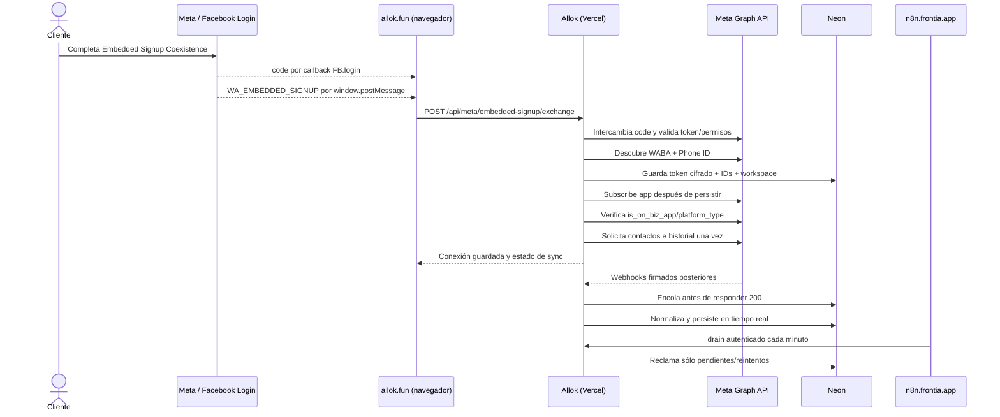
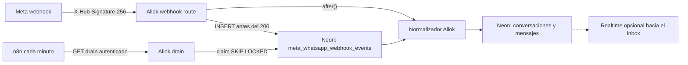

# Arquitectura de Allok WhatsApp Coexistence

## Flujo de onboarding, pasos 8–11

### Paso 8

Meta no llama a n8n con los eventos del popup. El `code` llega al callback de
`FB.login`; los IDs/sesión llegan al JavaScript de Allok por
`window.postMessage`. La página valida el origen Facebook e intenta combinar
ambos. Si los IDs no llegan en 2,5 segundos, envía el código y el servidor
descubre los activos autorizados; más de un candidato produce `409`.

### Paso 9

La página hace `fetch` a Allok, no a n8n. Envía el código, los IDs que Meta haya
entregado y el `state` de 15 minutos vinculado a workspace/modo. El servidor
reemplaza workspace/modo/usuario con el contexto firmado y valida por Graph que
el Phone ID recibido pertenece al WABA recibido.

### Paso 10

Allok intercambia el código directamente con Graph API usando el App Secret del
servidor. Valida que el token pertenezca a la app y tenga
`whatsapp_business_management` y `whatsapp_business_messaging`; luego suscribe
el WABA. Para Coexistence **omite `/register`**. Antes de llamar a Meta reclama
en Neon un marcador por nonce de onboarding; sólo el primer intercambio de ese
nonce solicita `smb_app_state_sync` y `history` mediante
`/{PHONE_ID}/smb_app_data`. Un onboarding nuevo tiene otro nonce.

### Paso 11

Neon guarda WABA ID, Phone Number ID, workspace, perfil, modo y token cifrado.
El navegador nunca ve el token. n8n tampoco recibe ni guarda el token del
cliente. La auditoría posterior se ejecuta con
`scripts/check-meta-coexistence-acceptance.ts <PHONE_NUMBER_ID>`; su salida
omite token, PIN, nonce y contenido de mensajes.

## Webhooks y realtime

Realtime y drain resuelven problemas distintos:

- `after()` da baja latencia al procesamiento; Realtime acelera la UI sólo si
  están configurados `REALTIME_INGEST_URL` y `REALTIME_INGEST_SECRET`.
- Neon es la fuente durable. Si esa ejecución termina antes, el evento sigue en
  `pending`.
- n8n llama `GET /api/meta/whatsapp/webhook/drain`; el endpoint usa lotes fijos
  de 25 y procesa en paralelo las colas Meta, WAHA y auto-reply. Reclama filas
  pendientes, recupera leases vencidos, aplica backoff y las marca `processed`
  o `failed`.
- “Neon entrega eventos pendientes” significa que **Allok consulta y reclama
  filas en Neon**. Neon no hace push a n8n y n8n no recibe webhooks de Meta.
- Eliminar el drain dejaría una ventana de pérdida operativa: el webhook ya fue
  aceptado por Meta, pero un `after()` interrumpido podría no procesarse hasta el
  cron diario. Por eso se mantiene como recuperación, no como reemplazo de
  realtime.

## Neon frente a n8n

Neon no sustituye n8n y n8n no sustituye Neon:

| Responsabilidad | Componente |
|---|---|
| Token exchange, firma, tenancy y cifrado | Allok/Vercel |
| Estado durable, dedup, leases, mensajes y conexiones | Neon |
| UI instantánea, si está configurada | Realtime |
| Scheduler del drain periódico | n8n |
| Normalización, persistencia y auto-replies | Allok/Vercel |

Moverlo todo a n8n haría que onboarding, secretos y persistencia dependieran de
un editor de workflows compartido. Moverlo todo a Neon no es posible: Postgres
no escucha `window.postMessage`, no intercambia OAuth por sí mismo y no ejecuta
la lógica HTTP. Cloudflare Workers podría alojar la API y el procesador, pero no
aporta una necesidad actual: Vercel + Neon ya pasa el build, la firma, la cola y
el tráfico real; migrar ahora añadiría dos runtimes y otra superficie de
secretos.
